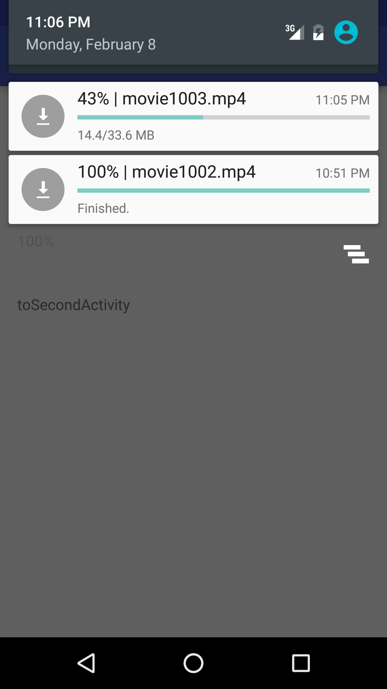

# DownloadManager
If you need to request and upload files using the network; See [OKHttpUtils](https://github.com/duzechao/OKHttpUtils)

Relative performance has improved with native support and one database, and many-to-many association table, <br/> support breakpoint download, load and download tasks set to the same task with multiple listeners, <br />

Eliminating the need to add only a listener to a broadcast address multiple pages at the same time listen to the same download thread troubles, <br/>
With the basic functions, temporarily can not think of what you need to add functionality, there is a demand put forward, I add the phrase, <br/>
dzc_ze@foxmail.com needs please send me by mail <br/>


##How to use：<br/>

```
downloadManager = DownloadManager.getInstance(this);
DownloadTask task = new DownloadTask();
String id = MD5.MD5(url);
task.setId(id);
task.setSaveDirPath(getExternalCacheDir().getPath() + "/");
task.setFileName(id+".jpg");
task.setUrl(url);
downloadManager.addDownloadTask(task);


//  Add a listener
downloadManager.addDownloadListener(task,listener);


//  Loads the prevoiusly set tasks from the database
downloadManager.loadAllDownloadTaskFromDB();

```

## Demo app:

Adding a notification for each task in the task bar <br>
 
