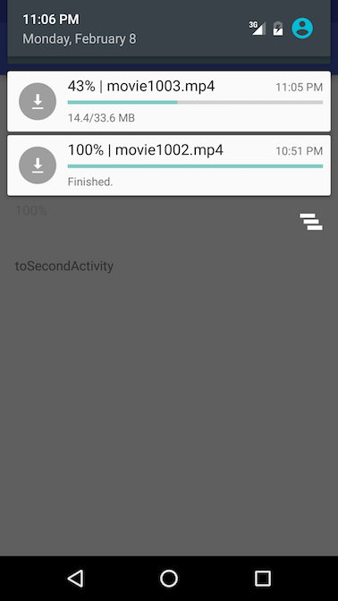

# DownloadManager
# 如果需要使用网络请求及上传文件 请看[OKHttpUtils](https://github.com/duzechao/OKHttpUtils)
一个下载Android框架，网络连接用了okhttp，数据库方面用GreenDao，<br/>
# 这个库只提供了较简单的下载功能，可根据需要扩展，由于使用了greendao，所以数据库方面扩展比较简易<br>
性能相对用原生的有所提升且支持数据库的一对一、一对多等多表关联，<br/>支持断点下载、加载下载的任务并可给同一个任务设置多个监听，<br/>
省去只能设置一个监听要添加一个广播来解决多个页面同时监听同一个下载线程的烦恼，<br/>
具备了基本功能，暂时想不出需要添加什么功能，请有需求的提出来，我加上去，<br/>
dzc_ze@foxmail.com 需求请通过邮箱发给我<br/>
# update log:<br/>
# 2016-07-09:
添加https支持<br/>
添加下载时对是否服务器支持断点下载进行验证,不支持的文件将重新下载<br/>
添加文档注释<br/>
bug修复<br/>

# 2016-03-20:
代码小更新，提升下载的时候的读写速度
# 2016-03-12:
bug修复，功能完善，<br/>当下载的文件已经存在但数据库没有记录的时候，<br/>会更新数据库记录而不会重复下载<br/>当文件不需要下载的时候，只会调用onPrepare和onComplete方法
<br/>
<br/>
使用方法：<br/>
downloadManager = DownloadManager.getInstance(this);<br/>
DownloadTask task = new DownloadTask();<br/>
String id = MD5.MD5(url);<br/>
task.setId(id);<br/>
task.setSaveDirPath(getExternalCacheDir().getPath() + "/");<br/>
task.setFileName(id+".jpg");<br/>
task.setUrl(url);<br/>
downloadManager.addDownloadTask(task);<br/>


新增方法：<br/>
getCurrentTaskById：获取当前已经在下载队列里的任务<br/>
getDBTaskById：获取数据库中存在的下载任务<br/>
getTaskById：获取当前队列和数据库中的任务<br/>
cancel：取消一个下载任务，此方法会删除数据库中保存的数据和下载的文件<br/>
pause：暂停一个下载任务<br/>
resume：恢复一个下载任务<br/>


添加监听<br/>
downloadManager.addDownloadListener(task,listener);


加载数据库存在的下载任务<br/>
downloadManager.loadAllDownloadTaskFromDB();


# DownloadManager
If you need to request and upload files using the network; See [OKHttpUtils](https://github.com/duzechao/OKHttpUtils)

Relative performance has improved with native support and one database, and many-to-many association table, <br/> support breakpoint download, load and download tasks set to the same task with multiple listeners, <br />

Eliminating the need to add only a listener to a broadcast address multiple pages at the same time listen to the same download thread troubles, <br/>
With the basic functions, temporarily can not think of what you need to add functionality, there is a demand put forward, I add the phrase, <br/>
dzc_ze@foxmail.com needs please send me by mail <br/>

# update log:<br/>
# 2016-03-12:
bug fixed，<br/>now,when the file already on the disk,only update the database and execute onPrepare() and onComplete()
<br/>
<br/>

## How to use：<br/>

```
downloadManager = DownloadManager.getInstance(this);
DownloadTask task = new DownloadTask();
String id = MD5.MD5(url);
task.setId(id);
task.setSaveDirPath(getExternalCacheDir().getPath() + "/");
task.setFileName(id+".jpg");
task.setUrl(url);
downloadManager.addDownloadTask(task);


new function add at 2016-03-10：<br/>
getCurrentTaskById：get the task from the running task list<br/>
getDBTaskById：get the task from database<br/>
getTaskById：getCurrentTaskById()＋getDBTaskById()<br/>
cancel：cancel a task,will delete the file and the info in the database<br/>
pause：pause a task<br/>
resume：resume a task<br/>


//  Add a listener
downloadManager.addDownloadListener(task,listener);


//  Loads the prevoiusly set tasks from the database
downloadManager.loadAllDownloadTaskFromDB();

```


## Demo app:

Adding a notification for each task in the task bar <br>
 
